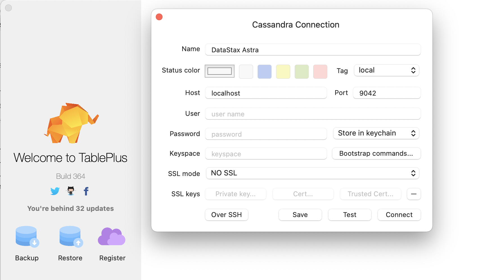

# Using the CQL Proxy to connect to Astra with a legacy connection
[DataStax Astra](https://astra.datastax.com) is a Serverless Managed Cassandra Database that allows users and developers to focus on business value instead of managing the cluster. Connectivity is done through a mutually encrypted TLS connection. Setting this up is made ease through the `Secure Connect Bundle` (SCB). This SCB is a zip file that contains all the secrets, keys and certificates to do this. 

In case you have an application that is not able to use the newer drivers that allow for connecting with the SCB, there is an alternative.

This alternative makes use of a [CQL Proxy](https://github.com/datastax/cql-proxy) that acts like a legacy Cassandra host and takes care of connecting to the Astra database.

## Run the CQL Proxy
Make sure you have downloaded the Secure Connect Bundle and have created an Application Token. Then run the CQL Proxy:
```sh
docker run --rm \
    -v <path-to-secure-connect-bundle>:/tmp/scb.zip \
    -p 9042:9042 \
    datastax/cql-proxy:v0.0.2 \
        --bundle /tmp/scb.zip \
        --username <astra-client-id> \
        --password <astra-client-secret>
```
Once started you will see the following output:
```json
{"level":"info","ts":1637662312.9020069,"caller":"proxy/proxy.go:171","msg":"proxy is listening","address":"[::]:9042"}
```

## Connecting your legacy application
In this example we'll make use of [TablePlus](https://tableplus.com/) to connect to Astra DB. Just create a new connection and choose `localhost` and port `9042` for the connection point.

